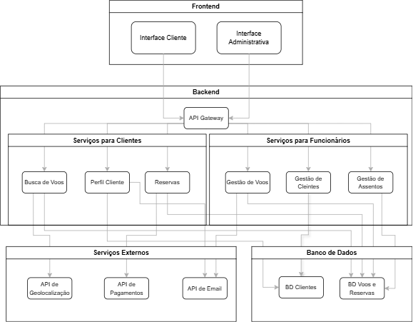

# Resolução da Atividade

  Figura X - Arquitetura SOA   

  

  Fonte: Material produzido pelos autores (2025).

## Descrição dos Componentes

- **Interface Cliente**: Tela acessada pelos clientes para buscar voos, fazer reservas e gerenciar seus dados.
- **Interface Administrativa**: Tela usada pelos funcionários da companhia aérea para gerenciar voos, assentos e dados dos clientes.
- **API Gateway**: Ponto central que recebe todas as requisições e redireciona para o serviço responsável.
- **Serviços para Clientes**:
  - **Busca de Voos**: Retorna opções de voos com base nos critérios de pesquisa.
  - **Perfil Cliente**: Gerencia cadastro e preferências do cliente.
  - **Reservas**: Processa reservas e efetua as marcações de assento.
- **Serviços para Funcionários**:
  - **Gestão de Voos**: Cria, edita e exclui voos.
  - **Gestão de Clientes**: Permite que funcionários acessem e modifiquem dados de clientes.
  - **Gestão de Assentos**: Define e atualiza configurações dos assentos dos voos.
- **Serviços Externos**:
  - **API de Geolocalização**: Identifica a localização do cliente.
  - **API de Pagamentos**: Processa pagamentos realizados no sistema.
  - **API de Email**: Envia confirmações e notificações por email.
- **Banco de Dados**:
  - **BD Clientes**: Armazena dados pessoais e cadastrais dos clientes.
  - **BD Voos e Reservas**: Guarda informações de voos, assentos e reservas realizadas.

---

### Fluxo e Relações 

#### Relações entre a Camada de Frontend e Backend

- **Interface Cliente → API Gateway**:  
  A interface do cliente envia todas as solicitações para o API Gateway, como busca de voos, cadastro, consulta de perfil e reservas.

- **Interface Administrativa → API Gateway**:  
  A interface usada pelos funcionários também se conecta ao API Gateway para acessar funcionalidades administrativas, como gestão de voos e clientes.

#### Relações do API Gateway com os Serviços

- **API Gateway → Serviço de Busca de Voos**:  
  Encaminha as solicitações de pesquisa feitas pelos clientes para o serviço que trata da busca por voos disponíveis.

- **API Gateway → Serviço de Reservas**:  
  Redireciona as solicitações de reserva para o serviço responsável por registrar e confirmar reservas.

- **API Gateway → Serviço de Perfil de Cliente**:  
  Encaminha requisições relacionadas ao cadastro, login ou alteração de dados dos clientes.

- **API Gateway → Serviço de Gestão de Voos**:  
  Direciona as ações administrativas de criação, edição e remoção de voos para o serviço correspondente.

- **API Gateway → Serviço de Gestão de Assentos**:  
  Encaminha configurações ou ajustes de assentos para o serviço específico de gestão de assentos.

- **API Gateway → Serviço de Gestão de Clientes**:  
  Redireciona as ações realizadas por funcionários relacionadas à visualização e edição de dados de clientes.

#### Relações dos Serviços com os Bancos de Dados

- **Serviço de Busca de Voos → BD Voos e Reservas**:  
  Consulta o banco de dados para obter informações sobre voos disponíveis e seus detalhes.

- **Serviço de Reservas → BD Voos e Reservas**:  
  Lê e atualiza o banco com as informações das reservas feitas e com os assentos ocupados.

- **Serviço de Perfil de Cliente → BD Clientes**:  
  Acessa o banco de clientes para buscar, inserir ou atualizar dados pessoais dos usuários.

- **Serviço de Gestão de Voos → BD Voos e Reservas**:  
  Realiza alterações no banco relacionadas à criação, modificação ou exclusão de voos.

- **Serviço de Gestão de Assentos → BD Voos e Reservas**:  
  Atualiza o banco com configurações de assentos, como layout e disponibilidade.

- **Serviço de Gestão de Clientes → BD Clientes**:  
  Permite que os dados dos clientes sejam consultados e atualizados por funcionários autorizados.

#### Relações com Serviços Externos

- **Serviço de Busca de Voos → API de Geolocalização**:  
  Usa a API para identificar a localização do usuário e sugerir aeroportos próximos.

- **Serviço de Reservas → API de Pagamentos**:  
  Integra-se com a API de pagamentos para processar a cobrança das passagens.

- **Serviço de Perfil de Cliente → API de Email**:  
  Envia emails automáticos após cadastro ou alteração de dados.

- **Serviço de Gestão de Voos → API de Email**:  
  Permite envio de notificações automáticas para clientes, como mudanças em voos.

### Justificativa dos Pontos da Arquitetura

- **Separação em Camadas**:  
  Facilita a manutenção e o desenvolvimento, pois cada parte do sistema tem uma responsabilidade bem definida.

- **API Gateway Centralizado**:  
  Centraliza a entrada de dados e direciona para os serviços corretos, permitindo maior controle sobre autenticação, roteamento e monitoramento.

- **Separação entre Serviços de Clientes e Funcionários**:  
  Garante segurança e organização, pois as regras de acesso e funcionalidades são diferentes para cada grupo.

- **Uso de Serviços Externos**:  
  Reduz o tempo de desenvolvimento e aumenta a confiabilidade ao integrar soluções já existentes para localização, pagamento e envio de email.

- **Bancos de Dados Separados**:  
  Organiza os dados de forma lógica e segura, separando informações sensíveis dos clientes das informações operacionais dos voos e reservas.

## Requisitos Não Funcionais

**RFN01 - Desempenho**  
O sistema deve responder rapidamente às ações do usuário, principalmente durante a busca por voos. A lentidão pode impactar negativamente a experiência e reduzir conversões. A arquitetura permite escalar serviços específicos, como o de busca, nos horários de maior uso.

> Exemplo prático: Durante o feriado, milhares de usuários realizam buscas simultâneas, e o sistema continua entregando resultados em poucos segundos sem travamentos.

---

**RFN02 - Segurança**  
É essencial proteger os dados pessoais e financeiros dos usuários. A arquitetura separa os dados sensíveis e integra serviços externos especializados em pagamentos para reduzir riscos de vazamento.

> Exemplo prático: Caso o serviço de busca de voos seja comprometido, os dados de cartões e documentos dos clientes permanecem protegidos em serviços isolados e seguros.

---

**RFN03 - Disponibilidade**  
O sistema deve estar disponível 24 horas por dia, 7 dias por semana, permitindo que clientes façam reservas a qualquer momento. A estrutura distribuída e modular garante que, mesmo que um serviço esteja em manutenção, os demais continuem funcionando normalmente.

> Exemplo prático: Durante a atualização do serviço de gestão de assentos, os usuários ainda conseguem buscar voos e acessar seus perfis sem interrupções.

---

**RFN04 - Escalabilidade**  
A aplicação deve conseguir lidar com aumentos repentinos de demanda, como em períodos promocionais ou alta temporada. Os serviços podem ser replicados de forma independente conforme o volume de requisições.

> Exemplo prático: Na Black Friday, o volume de reservas cresce até 500%, e o sistema mantém a estabilidade ao escalar apenas o serviço de reservas.

---

**RFN05 - Manutenibilidade**  
A manutenção e evolução do sistema devem ser simples e seguras. Com a separação em serviços independentes, atualizações em uma funcionalidade não impactam o restante do sistema, permitindo ajustes pontuais com menos risco.

> Exemplo prático: O serviço de pagamentos pode ser atualizado para um novo provedor sem necessidade de parar o sistema inteiro.

---

**RFN06 - Usabilidade**  
A experiência do usuário deve ser intuitiva e acessível, mesmo para pessoas com pouca familiaridade com tecnologia. A interface do cliente é modular e pode ser continuamente aperfeiçoada de forma independente dos serviços internos.

> Exemplo prático: Um usuário idoso consegue concluir a compra de uma passagem de forma simples e rápida, sem precisar de ajuda técnica.
